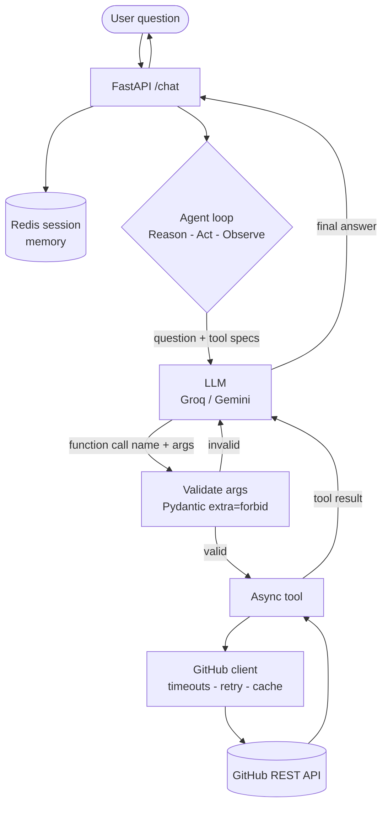

# 🐙 GitHub Insights Agent

[](https://github.com/Shagw/github-insights-agent/actions/workflows/ci.yml)


An **async AI agent** that answers natural-language questions about public GitHub
repositories and users. It uses a fast LLM (Groq by default, Gemini optional) to
reason, and calls the **GitHub
REST API as tools** in a bounded Reason → Act → Observe loop — then grounds every
answer in the data the tools returned.

> Ask *"How many stars does fastapi/fastapi have, and what languages is it written in?"*
> and the agent decides which tools to call, fetches the data, and answers.

Built as a backend-focused portfolio project: the emphasis is on the **agent loop,
tool design, resilience, observability, and tests** — not a heavy UI.

---

## ✨ What it does

- **Tool-calling agent** — the LLM chooses which GitHub API calls to make, with
  arguments, to answer a question. Supports **multi-step** questions (chaining
  several tool calls before answering).
- **Five read-only tools** — repo info, user info, language breakdown, recent
  commits, and a user's repositories.
- **Strict argument validation** — every tool call the model produces is validated
  with Pydantic (`extra="forbid"`) before execution; bad arguments are fed back to
  the model to self-correct instead of crashing.
- **Resilient GitHub client** — timeouts, retry-with-backoff on transient failures,
  a TTL cache, and graceful handling of GitHub's rate limit.
- **Pluggable LLM** — Groq (default, fast + generous free tier) or Gemini, via one
  env var.
- **Conversation memory** — Redis-backed sessions so follow-up questions resolve
  references ("the *above* user").
- **Production-shaped API** — FastAPI with `/chat`, `/health`, `/metrics`, auto
  `/docs`, request tracing, usage counters, API-key auth, and CORS.
- **Tested & evaluated** — 60 offline tests plus a behavioral eval harness.

---

## 🧠 How it works




```
                          ┌──────────────────────────────────────┐
  user question ─────────►│           run_agent() loop           │
                          │  (Reason → Act → Observe, bounded)    │
                          └──────────────────────────────────────┘
                                   │                ▲
                    send question  │                │ tool result
                    + tool specs   ▼                │ (or validation error)
                          ┌─────────────────┐       │
                          │   LLM (Groq /   │       │
                          │     Gemini)     │       │
                          └─────────────────┘       │
                                   │                │
                    function call  │                │
                    {name, args}   ▼                │
                          ┌─────────────────────────┴──┐
                          │ validate args (Pydantic)   │
                          │ → dispatch async tool       │
                          └─────────────────────────────┘
                                   │
                                   ▼
                          ┌─────────────────────────────┐
                          │  GitHubClient (async httpx)  │
                          │  timeouts · retry · cache    │
                          └─────────────────────────────┘
                                   │
                                   ▼
                           GitHub REST API
```

1. The question and the **tool declarations** go to the LLM.
2. If the LLM replies with a **function call**, the agent validates the arguments,
   runs the matching async tool, and sends the result back.
3. The LLM observes the result and either calls another tool or writes the final
   answer. A `MAX_STEPS` cap guarantees termination.

---

## 🛠️ Tech stack

| Layer | Choice | Why |
|-------|--------|-----|
| Language | **Python 3.13** | Strong typing + best LLM ecosystem |
| LLM | **Groq** (default, `openai/gpt-oss-20b`) or **Gemini** — pluggable via `LLM_PROVIDER` | Groq's free tier is fast + generous; both support tool calling |
| Tool validation | **Pydantic v2** | Validates untrusted LLM args at the boundary |
| HTTP client | **httpx (async)** | Async I/O + built-in timeouts for the resilience story |
| External API | **GitHub REST API** | Public data; optional token raises the rate limit |
| Web framework | **FastAPI** | Typed, async, auto `/docs` |
| Server | **uvicorn** | ASGI runtime |
| Tests | **pytest** + TestClient | Deterministic, fully offline |

---

## 📁 Project structure

```
github-insights-agent/
├── app/
│   ├── config.py          # settings from .env (provider, keys, model, token, CORS, Redis)
│   ├── key_manager.py     # round-robin key rotation with cooldown
│   ├── github_client.py   # async GitHub client: timeouts, retry/backoff, TTL cache
│   ├── tools.py           # the 5 tools (shape GitHub JSON into small clean dicts)
│   ├── schemas.py         # Pydantic arg schemas + Gemini & Groq tool declarations
│   ├── sessions.py        # Redis-backed conversation memory (in-memory fallback)
│   ├── agent.py           # the async Reason→Act→Observe loop (Groq + Gemini)
│   └── api.py             # FastAPI: /chat /health /metrics /docs + middleware
├── tests/                 # 60 offline tests (faked GitHub + faked LLM)
├── eval/                  # behavioral eval set + scoring harness
├── frontend/              # optional Vite + React chat UI (thin client over /chat)
├── demo.py                # drives the running API with example questions
├── requirements.txt
└── .env.example
```

---

## 🔧 The tools

| Tool | GitHub endpoint | Returns |
|------|-----------------|---------|
| `get_repo_info(owner, repo)` | `/repos/{owner}/{repo}` | stars, forks, open issues, language, topics, description |
| `get_user_info(username)` | `/users/{username}` | name, bio, company, location, public repos, followers |
| `list_languages(owner, repo)` | `/repos/{owner}/{repo}/languages` | language breakdown as **percentages** |
| `list_recent_commits(owner, repo, limit)` | `/repos/{owner}/{repo}/commits` | recent commits (sha, message, author, date) |
| `list_user_repos(username, limit, sort)` | `/users/{username}/repos` | a user's repositories (name, stars, language), sorted by recent activity |

---

## 🚀 Run it locally

> **TL;DR for forkers:** clone → make a venv → `pip install -r requirements.txt` →
> copy `.env.example` to `.env` and paste a free Groq key → `uvicorn app.api:app --reload`.
> That's it. (Redis and a GitHub token are optional.)

### Prerequisites
- **Python 3.11+** (developed on 3.13)
- A free **Groq API key** — https://console.groq.com/keys (one key is plenty)
- *(optional)* **Redis** for persistent conversation memory — without it the app
  falls back to in-memory sessions automatically
- *(optional)* **Node 18+** if you want the React UI

### 1. Install
```bash
git clone https://github.com/Shagw/github-insights-agent.git
cd github-insights-agent

python3 -m venv venv
source venv/bin/activate         # Windows: venv\Scripts\activate
pip install -r requirements.txt
```

### 2. Configure
```bash
cp .env.example .env
```
Edit `.env` — the only thing you *need* is one LLM key:
- `LLM_PROVIDER` — `groq` (default) or `gemini`
- `GROQ_API_KEY` — free key from https://console.groq.com/keys
- `GROQ_MODEL` — default `openai/gpt-oss-20b` (see
  https://console.groq.com/docs/models for models your account can use)
- `GITHUB_TOKEN` — **optional**; without it you get 60 GitHub requests/hour, with it 5000
- `API_KEY` — **optional**; if set, `/chat` requires the `X-API-Key` header (leave
  empty for local dev / the UI)
- `REDIS_URL` — **optional**; defaults to `redis://localhost:6379/0`, falls back to
  in-memory if unreachable

> To use Gemini instead: set `LLM_PROVIDER=gemini` and `GEMINI_API_KEY_1=...`
> (free key at https://aistudio.google.com/app/apikey).

### 3. Start the API
```bash
uvicorn app.api:app --reload
```
Open the interactive docs at **http://localhost:8000/docs** — you can call `/chat`
right from the browser.

### 4. Try the demo script
```bash
python demo.py
# or a single question:
python demo.py "What languages is fastapi/fastapi written in?"
```

### Example `curl`
```bash
curl -s http://localhost:8000/chat \
  -H "Content-Type: application/json" \
  -d '{"question": "How many stars does fastapi/fastapi have?"}' | jq
```

---

## ✅ Testing

All tests run **offline** — GitHub is faked with `httpx.MockTransport` and the LLM
is faked with a scripted `FakeChat`, so no network or API quota is used.

```bash
pytest                       # 60 tests
```

Covers: the resilient client (retry / no-retry / cache), tool response shaping,
schema validation, round-robin key rotation, the agent loop for **both** providers
(single-tool, multi-tool, error recovery, refusal), Redis-backed sessions, and every
API endpoint (auth, tracing, error mapping, CORS).

---

## 📊 Evaluation

Unit tests check code correctness; the **eval harness** checks *agent behavior* —
does it call the right tools and ground its answer?

```bash
# offline: verify the grading logic against ideal outcomes (no Gemini)
python -m eval.run_eval --self-test

# live: run the real agent over the eval set (needs Gemini keys + network)
python -m eval.run_eval
```

The set has **15 cases** across three categories: single-tool (8), multi-tool (3),
and out-of-scope/refuse (4). Each is graded on tool selection **and** answer content.

---

## 🖥️ Optional web UI (React)

A minimal single-page chat UI lives in `frontend/` (Vite + React). It's a thin
client over the same `/chat` API — the backend is the star; this is just a nicer
way to demo it.

```bash
# 1. start the backend (in one terminal)
uvicorn app.api:app --reload

# 2. start the UI (in another terminal)
cd frontend
npm install
npm run dev        # opens http://localhost:5173
```

In dev, Vite proxies `/api/*` to the backend at `http://localhost:8000`, so the
browser talks to a single origin (no CORS friction).

> **A note on auth and the UI.** The `X-API-Key` gate is a *server-side* control
> for machine-to-machine callers (scripts, other services). An API key is a secret
> and must never be shipped in browser code, so the web UI intentionally does **not**
> send one — run the local backend with `API_KEY` unset (unauthenticated) for the UI.
> For a browser app that needs protection, the right pattern is real user
> authentication (login/session) or a backend-for-frontend that holds the key
> server-side.

---

## 💡 Design decisions (the interesting bits)

- **Async throughout.** GitHub calls use `httpx.AsyncClient`; the synchronous Gemini
  SDK is wrapped in `asyncio.to_thread` so it never blocks the event loop. This keeps
  the API responsive under concurrent load.
- **Resilience lives in one layer.** All retry/backoff/caching/rate-limit logic is in
  `github_client.py`, so every tool inherits it and the tools stay pure and testable.
- **Transient vs. permanent errors.** Only transient failures (timeouts, 5xx) are
  retried; permanent ones (404, rate-limit 403) are not — retrying them just wastes
  quota.
- **Untrusted LLM output.** Tool arguments are validated with strict Pydantic schemas
  before anything executes; validation errors are returned to the model so it can
  self-correct.
- **Bounded loop.** `MAX_STEPS` guarantees the agent always terminates, even if the
  model keeps requesting tools.
- **Pluggable LLM provider.** The LLM is isolated behind the agent loop, so
  switching backends is a contained change. `LLM_PROVIDER=groq` (default) uses
  Groq's fast, generous free tier; `LLM_PROVIDER=gemini` uses Google Gemini. Tool
  validation, dispatch, resilience, sessions, and the API are provider-agnostic.
- **Key rotation.** Keys rotate round-robin with a cooldown, so load spreads
  across the pool and a single key's rate limit doesn't take the service down.
- **Conversation memory via Redis.** `/chat` accepts a `session_id`; prior turns are
  stored in Redis (with a TTL for auto-expiry) and replayed into the model so
  follow-ups like *"how many repos does the above user have?"* resolve. If Redis is
  down, it falls back to an in-memory store so the app still works.
- **Observability.** Every request gets an id, is timed, and is logged; `/metrics`
  exposes simple usage counters.

---

## ⚠️ Known limitations

- **Read-only.** The agent only reads public GitHub data — no writes, by design.
- **In-memory cache & metrics.** Both reset on restart; a multi-instance deployment
  would use Redis / a metrics backend.
- **Gemini free-tier quota.** Live runs are limited by the daily quota; the tests and
  eval self-test are fully offline to work around this.
- **Conversation memory needs Redis for persistence.** Memory works out of the box
  (in-memory fallback), but survives restarts / scales across instances only with
  Redis running.

---

## 🤝 Contributing

Contributions are welcome! This is open source (MIT) — fork it, improve it, and open
a pull request. See **[CONTRIBUTING.md](CONTRIBUTING.md)** for setup, how to run the
tests, and PR guidelines. Good first contributions: add a new read-only GitHub tool,
add eval cases, or improve the React UI.

---

## 📄 License

MIT — free to use and adapt. See [LICENSE](LICENSE).
